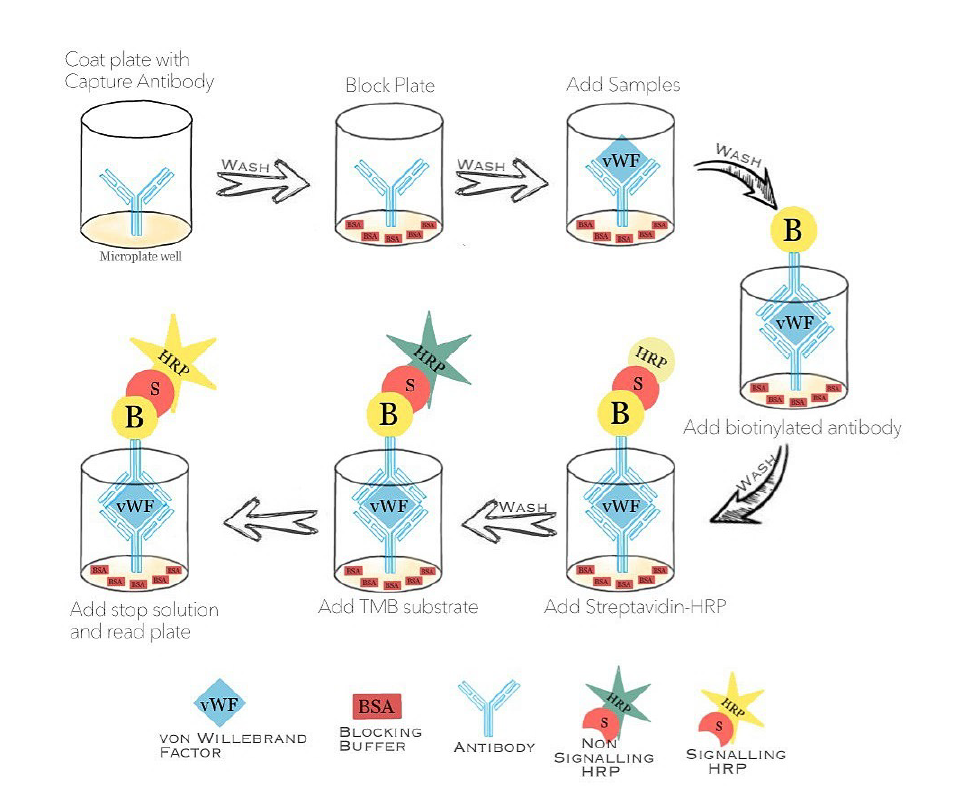
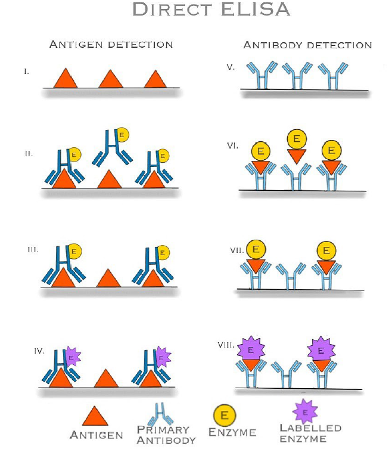
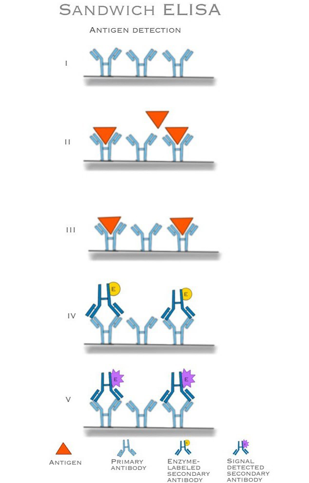
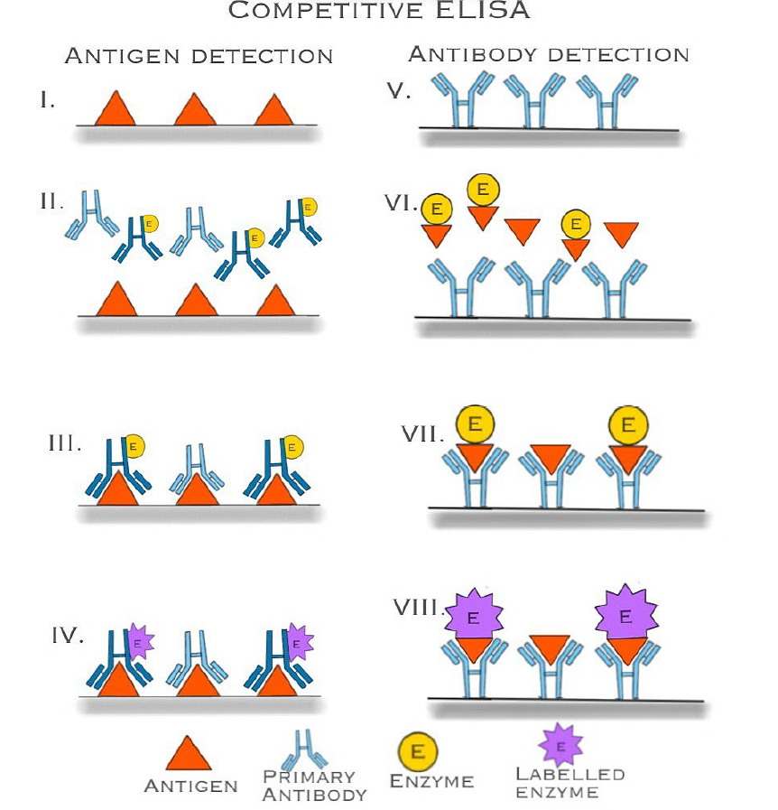

### Procedure
 
The following phases make up the general ELISA process:
 

* <b>Coating:</b> 
An antigen or antibody is applied to a solid polystyrene plate that has an affinity for its cognate antibody or antigen, respectively.

* <b>Blocking:</b> 
After coating, the plate is rinsed and covered with a blocking buffer to inhibit the sample and secondary antibody binding to non-specific locations on the plate.

* <b>Sample addition:</b> 
The sample containing the target antigen is introduced to the wells and allowed to interact with the captured antibody that has been immobilized. The wells are rinsed to get rid of any unbound material after an appropriate amount of incubation time.

* <b>Detection:</b> 
The antigen that has previously been immobilized on the solid surface is allowed to attach to the detection antibody, which is specific to a distinct epitope of the antigen, after it has been added to the wells. Typically, an enzyme like horseradish peroxidase (HRP), alkaline phosphatase (ALP), or -galactosidase is used to mark the detecting antibody.

* <b>Enzyme-substrate reaction:</b> 
After washing, an enzyme substrate is introduced to the wells. The enzyme-substrate reacts with the enzyme label to create a detectable signal. Depending on the substrate being utilized, the signal may take the form of a color shift, fluorescence, or chemiluminescence.

* <b>Data analysis:</b> 
A microplate reader that detects the absorbance, fluorescence, or luminescence can quantify the signal produced, which is proportional to the amount of antigen in the sample.

 

##### Types of ELISA:
There are mainly four types of ELISA . Each of them has unique advantages, disadvantages, and suitability based on the application and the type of antigen being tested. The different types of ELISA namely are:  

* Direct
* Indirect
* Sandwich
* Competitive
* Open Sandwich

##### Direct ELISA:  
In Direct ELISA, the antigen or antibody is immobilized directly onto a surface. When the sample is added, any complementary molecules present will bind to the immobilized antigen or antibody. After washing off unbound substances, an enzyme-linked antibody or antigen is introduced. If the target is present, a reaction occurs, and a detectable signal is produced. This method is straightforward but may lack sensitivity and specificity due to non-specific binding.

 

##### Indirect ELISA:  
In Indirect ELISA, the antigen is immobilized on the surface. The sample containing antibodies is added. If specific antibodies are present, they bind to the antigen. After washing off unbound substances, an enzyme-labeled secondary antibody, which recognizes the primary antibody, is added. The enzyme reaction produces a signal. Indirect ELISA is versatile and widely used in disease diagnosis, especially for detecting antibodies in patient samples.

 

##### Sandwich ELISA:  
In Sandwich ELISA, the surface is coated with a capture antibody specific to the antigen of interest. The sample is added, and if the antigen is present, it binds to the capture antibody. After washing, a labeled detection antibody, recognizing a different epitope on the antigen, is added. This dual binding enhances specificity. After washing off unbound substances, a signal is generated. Sandwich ELISA is highly specific, making it suitable for quantitative analysis of antigens, especially in clinical diagnostics.

 

##### Competitive ELISA:  
Competitive ELISA involves competition between a labeled antigen or antibody and the antigen in the sample for binding sites on a solid-phase-bound antibody or antigen. If the sample antigen concentration is high, it competes more effectively, leading to reduced binding of the labeled molecule. After washing, a signal is generated. Competitive ELISA is useful when specificity is crucial and is often employed to detect small molecules or drugs.

 

 

##### Open Sandwich ELISA (OS-ELISA):  
OS-ELISA utilizes DNA technology. When the antigen is present, the interaction between variable regions of heavy and light chains (VH and VL) is enhanced. This complex formation is detected using an enzyme-labeled antibody. OS-ELISA offers high specificity for both macromolecules and haptens. Its unique advantage lies in its ability to discern specific molecular interactions, making it valuable in specialized research contexts.

##### Diseases that can be diagnosed using ELISA
* Ebola
* HIV, which causes AIDS
* Lyme disease
* Pernicious anemia
* Rotavirus
* Carcinoma of the epithelial cells
* Toxoplasmosis
* Syphilis
* Zika virus
* Varicella-zoster virus, which causes chicken pox and shingles
* Rocky Mountain spotted fever

##### Advantages
* ELISA tests are highly specific and give an accurate diagnosis of a particular disease since two antibodies are used
* It can be performed very quickly and can yield results within an hour
* ELISA tests are not so expensive and can be performed in most of the laboratories easily
* It can be used to measure the concentration of an antigen or antibody in a sample and is useful for monitoring disease progression or response to treatment

##### Applications
* Medical diagnostics (e.g., disease detection, hormone analysis)
* Monitoring of autoimmune diseases
* Drug testing in urine and blood samples
* Allergy testing (e.g., food allergies)
* Detection of infectious diseases (e.g., HIV, hepatitis)
* Environmental monitoring (e.g., detecting pollutants)
* Research and development in biotechnology and pharmaceuticals
* Veterinary diagnostics (e.g., animal diseases)
* Quality control in food and beverage industries
* Detection of specific proteins in research studies